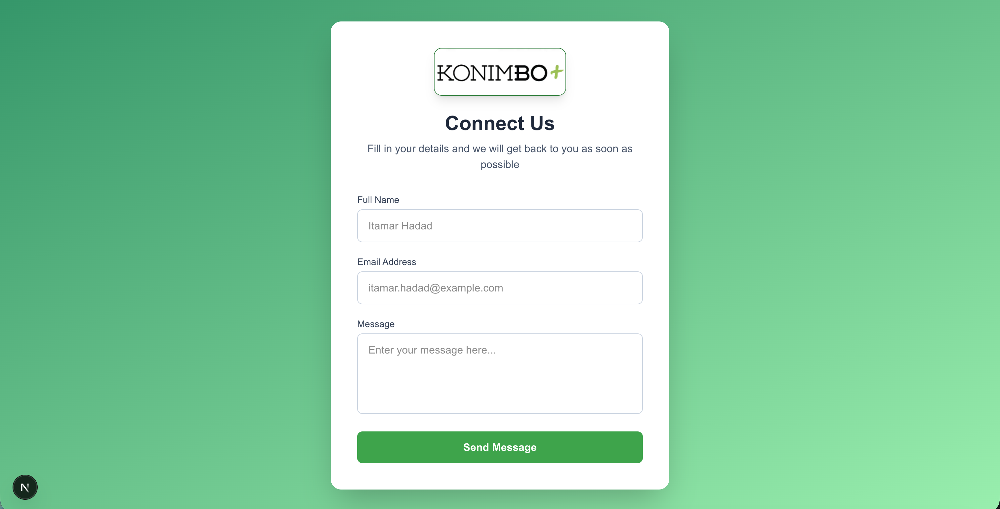

# Landing Page

## Contact Form

### Konimbo Assignment

A responsive landing page built with Next.js and Tailwind CSS, featuring a contact form that saves submissions to Airtable.

## Tech Stack

- Next.js 16
- React
- Tailwind CSS
- Airtable API

## Features

- Responsive design
- Contact form with validation
- Data saved to Airtable
- Success/error feedback to user

## Getting Started

### 1. Clone the repository

bash`git clone https://github.com/Itamar-Hadad/Landing-Page
cd Landing-Page`

### 2. Install dependencies

bash`npm install`

### 3. Set up environment variables

Create a `.env.local` file in the root directory:

AIRTABLE_TOKEN=your_token_here
AIRTABLE_BASE_ID=your_base_id_here
AIRTABLE_TABLE_NAME=Contacts

### 4. Run the development server

npm run dev

Open [http://localhost:3000](http://localhost:3000) in your browser.

## Project Structure

bash`app/
├── page.js # Landing page UI
└── api/
└── contact/
└── route.js # API route, saves to Airtable`

## Preview

